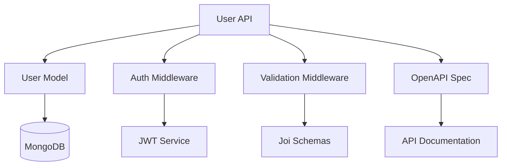
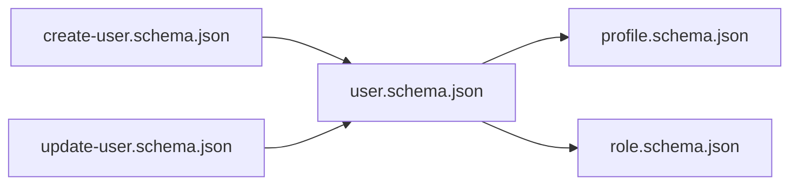

# Copilot Command: Glean - External Source Ingestion

## Variables

- Folders, Files and Indexes are stored in `.ai-ley/shared/variables/folder-structure.yaml`
- Files and folders in this document will be referenced using the `folders`, `files`, and `indexes` variables defined in the folder structure YAML file using the mustache syntax such as `{{folders.plan}}`.

## References

- See the `{{files.instructions}}` file for global instructions that apply to all commands.
- Reference applicable personas in `{{folders.personas}}` and instructions in `{{folders.instructions}}` as needed.
- In the event of conflicting information utilize the `.ai-ley/shared/conflict-resolution.md` guidelines.

## Goal

Given:

- One or more external sources: `{git_repo, website_url, file_url, local_folder, local_file}`
- A target working folder name
- An operating mode (`plan`, `dry-run`, or `apply`)

Produce:

- Acquired and normalized content in `.ai-ley/shared/external/<target-folder>/`
- Comprehensive analysis and inventory of ingested content
- Extracted reusable insights, patterns, and knowledge
- Proposed improvements to existing AI-Ley instructions, personas, prompts, agents, and chatmodes
- New AI-Ley assets created from templates where gaps are identified
- Updated indexes with new/modified assets
- Complete documentation and provenance tracking

## Command

You are an expert knowledge engineer and content curator specializing in information extraction, pattern recognition, and knowledge base enhancement. Your expertise includes code analysis, documentation synthesis, API specification processing, and intelligent content categorization.

### Step 1: Input Validation & Mode Selection

**Parse Command Parameters**:

- `source` = One or more of: git_repo, website_url, file_url, local_folder, local_file
- `target_folder` = Name for working directory (kebab-case)
- `mode` = `{{mode|apply}}` (default: `apply`)
- `depth` = `{{depth|3}}` (for git clones and web crawls, default: 3)
- `pathspec` = `{{pathspec|}}` (optional, for git repo subdirectory filtering)
- `max_file_size` = `{{max_file_size|25MB}}` (default: 25MB)

**Validate Inputs**:

- Ensure at least one source is provided
- Validate target_folder name (alphanumeric, hyphens only)
- Confirm mode is one of: `plan`, `dry-run`, `apply`
- Check depth is positive integer (1-10)
- Validate max_file_size format (e.g., "10MB", "1GB")

**Mode Behaviors**:

- **`plan`**: Analyze source and report what would be acquired; no files written
- **`dry-run`**: Simulate acquisition and processing; generate diffs and reports without writing to AI-Ley assets
- **`apply`**: Full execution with writes to `.ai-ley/shared/external/` and AI-Ley assets

### Step 2: Source Acquisition & Normalization

**Create Working Directory**:

```
.ai-ley/shared/external/<target-folder>/
├── _provenance.json          # Source metadata and provenance
├── content/                  # Acquired source content
├── .preview/                 # Generated previews and summaries
├── INVENTORY.md              # File catalog
├── SUMMARIES.md              # Per-file summaries
├── EXTRACTS.md               # Reusable snippets
├── IMPROVEMENTS.md           # Proposed AI-Ley enhancements
├── QUESTIONS.md              # Open questions and decisions
├── CHANGELOG.generated.md    # Changes to AI-Ley assets
└── SECURITY_FINDINGS.md      # Security/PII scan results (if applicable)
```

**Git Repository Acquisition**:

When `git_repo` is provided:

1. **Shallow Clone**:

   ```bash
   git clone --depth={{depth}} {{pathspec}} {{git_repo}} .ai-ley/shared/external/{{target_folder}}/content
   ```

2. **Pathspec Filtering** (if provided):

   - Only acquire specified directories/files
   - Example: `pathspec=src/,docs/` limits to those folders

3. **Record Provenance**:
   ```json
   {
     "source_type": "git",
     "url": "https://github.com/owner/repo.git",
     "commit": "abc123def456",
     "branch": "main",
     "pathspec": "src/,docs/",
     "depth": 3,
     "acquired_at": "2025-11-09T12:34:56Z",
     "file_count": 142,
     "total_size_bytes": 5242880
   }
   ```

**Website URL Acquisition**:

When `website_url` is provided:

1. **Respect Robots.txt**:

   - Check `/robots.txt` and honor `Disallow` rules
   - Check for `noindex` meta tags and `X-Robots-Tag` headers
   - Skip disallowed paths

2. **Crawl Strategy**:

   - Start at provided URL
   - Follow links to depth={{depth}} (default: 3)
   - Prefer sitemap.xml if available for efficient discovery
   - Stay within same domain (no external links)

3. **MIME Type Filtering** (allowlist):

   - `text/*` (html, plain, markdown, csv)
   - `application/json`, `application/xml`
   - `application/pdf` (extract text only)
   - `application/vnd.openxmlformats-officedocument.*` (Office docs)
   - Reject: images, videos, audio, executables

4. **Content Extraction**:

   - For HTML: extract main content (remove nav, ads, footers)
   - For PDFs: extract text and structure
   - For Office docs: extract text content

5. **Archive Handling**:

   - Detect `.zip`, `.tar.gz`, `.tar.bz2`
   - Extract to `content/extracted/` subfolder
   - Process extracted files recursively

6. **Record Provenance**:
   ```json
   {
     "source_type": "website",
     "base_url": "https://example.com/docs",
     "crawl_depth": 3,
     "pages_acquired": 47,
     "last_modified": "2025-11-08T14:22:00Z",
     "etag": "\"abc123-xyz\"",
     "acquired_at": "2025-11-09T12:34:56Z",
     "total_size_bytes": 2097152
   }
   ```

**File URL Acquisition**:

When `file_url` is provided:

1. **Download File**:

   - Use HTTP GET with proper User-Agent
   - Follow redirects (max 5)
   - Respect `Content-Type` and `Content-Length`

2. **MIME Type Validation**:

   - Check against allowlist (same as website crawl)
   - Reject disallowed types

3. **Archive Extraction** (if applicable):

   - Extract to `content/extracted/`

4. **Record Provenance**:
   ```json
   {
     "source_type": "file_url",
     "url": "https://example.com/file.pdf",
     "content_type": "application/pdf",
     "content_length": 1048576,
     "etag": "\"xyz789\"",
     "last_modified": "2025-11-07T10:00:00Z",
     "acquired_at": "2025-11-09T12:34:56Z",
     "checksum_sha256": "abc123..."
   }
   ```

**Local Folder Acquisition**:

When `local_folder` is provided:

1. **Read-Only Snapshot**:

   - Copy entire folder structure to `content/`
   - Preserve file timestamps and attributes
   - Create read-only copies (don't modify originals)

2. **Record Provenance**:
   ```json
   {
     "source_type": "local_folder",
     "path": "/Users/example/projects/myproject",
     "file_count": 89,
     "total_size_bytes": 3145728,
     "acquired_at": "2025-11-09T12:34:56Z",
     "snapshot_checksum": "def456..."
   }
   ```

**Local File Acquisition**:

When `local_file` is provided:

1. **Copy File**:

   - Copy to `content/`
   - Preserve metadata

2. **Record Provenance**:
   ```json
   {
     "source_type": "local_file",
     "path": "/Users/example/document.pdf",
     "size_bytes": 524288,
     "last_modified": "2025-11-08T16:30:00Z",
     "acquired_at": "2025-11-09T12:34:56Z",
     "checksum_sha256": "ghi789..."
   }
   ```

### Step 3: Security & Hygiene Filtering

**Default Ignore Patterns**:

```
# Version control
.git/
.svn/
.hg/

# Dependencies
node_modules/
vendor/
venv/
.venv/
__pycache__/

# Build artifacts
dist/
build/
target/
out/
.next/
.nuxt/

# Secrets & credentials
.env
.env.*
*.pem
*.key
*.p12
*.pfx
id_rsa*
id_dsa*
id_ecdsa*
id_ed25519*
credentials.json
service-account*.json

# Large binaries (>25MB by default)
*.bin
*.exe
*.dll
*.so
*.dylib
# (check size threshold)
```

**Secrets & PII Scan**:

1. **Scan for Sensitive Patterns**:

   - API keys: `api[_-]?key.*[:=]\s*['"]?[a-zA-Z0-9]{20,}['"]?`
   - AWS keys: `AKIA[0-9A-Z]{16}`
   - Private keys: `-----BEGIN.*PRIVATE KEY-----`
   - Passwords: `password.*[:=]\s*['"]?[^\s'"]+['"]?`
   - Email addresses: `[a-zA-Z0-9._%+-]+@[a-zA-Z0-9.-]+\.[a-zA-Z]{2,}`
   - Credit cards: `\b\d{4}[\s-]?\d{4}[\s-]?\d{4}[\s-]?\d{4}\b`
   - SSN: `\b\d{3}-\d{2}-\d{4}\b`

2. **If Hits Found**:

   - Log to `SECURITY_FINDINGS.md`:

     ```markdown
     # Security Findings

     ## High Risk

     ### API Key Exposure

     - **File**: `config/app.js:42`
     - **Pattern**: API key detected
     - **Action**: Masked in all derived artifacts
     - **Recommendation**: Remove from source; use environment variables

     ## Medium Risk

     ### Email Addresses

     - **Count**: 15 occurrences
     - **Action**: Masked in public-facing summaries
     ```

   - Mask sensitive data in derived artifacts:
     - API keys: `API_KEY_REDACTED_***`
     - Emails: `user@***MASKED***`
     - Credit cards: `****-****-****-1234`

**Path Traversal Prevention**:

- Reject files with `..` in paths
- Reject absolute paths
- Reject symlinks that escape target folder
- Normalize all paths to prevent directory traversal attacks

### Step 4: Content Inventory & Classification

**Create INVENTORY.md**:

```markdown
# Content Inventory

<!-- generated-by: ai-ley glean | mode:apply | source:git_repo | timestamp: 2025-11-09T12:34:56Z -->

## Summary

- **Total Files**: 142
- **Total Size**: 5.0 MB
- **File Types**: 12
- **Source**: https://github.com/owner/repo.git (commit: abc123)

## File Classification

| File                 | Type       | Category      | Size    | Checksum      | Notes              |
| -------------------- | ---------- | ------------- | ------- | ------------- | ------------------ |
| `src/api/users.js`   | JavaScript | Code          | 8.2 KB  | sha256:abc... | REST API endpoints |
| `docs/API.md`        | Markdown   | Documentation | 12.4 KB | sha256:def... | API reference      |
| `openapi.yaml`       | YAML       | Specification | 24.1 KB | sha256:ghi... | OpenAPI 3.0 spec   |
| `src/models/user.js` | JavaScript | Code          | 4.5 KB  | sha256:jkl... | Data model         |
| `README.md`          | Markdown   | Documentation | 6.8 KB  | sha256:mno... | Project overview   |

## Categories

### Code (78 files, 2.1 MB)

- JavaScript: 45 files
- Python: 18 files
- TypeScript: 15 files

### Documentation (32 files, 1.8 MB)

- Markdown: 28 files
- PDF: 4 files

### Specifications (8 files, 512 KB)

- OpenAPI: 3 files
- JSON Schema: 5 files

### Configuration (12 files, 128 KB)

- YAML: 7 files
- JSON: 5 files

### Diagrams (6 files, 256 KB)

- PlantUML: 4 files
- Mermaid: 2 files

### Data (6 files, 384 KB)

- CSV: 4 files
- JSON: 2 files
```

**Classification Logic**:

- **Code**: Source files (.js, .py, .ts, .java, .go, .rb, .php, .cs, etc.)
- **Documentation**: Markdown, text, PDF, Office docs
- **Specifications**: OpenAPI, AsyncAPI, GraphQL, Protobuf, Avro, JSON Schema
- **Configuration**: YAML, JSON, TOML, INI, env files
- **Diagrams**: PlantUML (.puml), Mermaid (.mmd), draw.io
- **Data**: CSV, JSON, XML data files
- **Other**: Files not matching above categories

### Step 5: Multi-Pass Processing

**Pass 1: File-Level Summarization**

For each file, generate a concise summary in `SUMMARIES.md`:

```markdown
# File Summaries

<!-- generated-by: ai-ley glean | mode:apply | source:git_repo | timestamp: 2025-11-09T12:34:56Z -->

## Code Files

### `src/api/users.js`

**Type**: JavaScript REST API
**Size**: 8.2 KB
**Purpose**: User management API endpoints

**Summary**:
Implements CRUD operations for user resources:

- GET /api/users - List users with pagination
- GET /api/users/:id - Get user by ID
- POST /api/users - Create new user
- PUT /api/users/:id - Update user
- DELETE /api/users/:id - Delete user

**Key Components**:

- Express.js router
- Input validation using Joi
- JWT authentication middleware
- Error handling with custom error classes

**Dependencies**: express, joi, jsonwebtoken, bcrypt

**Patterns Used**: RESTful API, middleware pattern, async/await

---

### `src/models/user.js`

**Type**: JavaScript Data Model
**Size**: 4.5 KB
**Purpose**: User entity and database schema

**Summary**:
Mongoose schema for User entity with:

- Fields: email, passwordHash, firstName, lastName, role, createdAt, updatedAt
- Indexes: unique email
- Methods: comparePassword, toJSON (excludes password)
- Hooks: pre-save password hashing

**Key Components**:

- Mongoose schema definition
- Password hashing with bcrypt
- Virtual properties
- Instance methods

**Dependencies**: mongoose, bcrypt

**Patterns Used**: Active Record pattern, data validation

---

## Documentation Files

### `docs/API.md`

**Type**: API Documentation
**Size**: 12.4 KB
**Purpose**: Comprehensive API reference

**Summary**:
Complete documentation for REST API:

- Authentication and authorization
- Endpoint reference with examples
- Request/response formats
- Error codes and handling
- Rate limiting and quotas

**Key Topics**:

- JWT-based authentication
- Role-based access control (RBAC)
- Pagination and filtering
- API versioning strategy
- Security best practices

---

## Specification Files

### `openapi.yaml`

**Type**: OpenAPI 3.0 Specification
**Size**: 24.1 KB
**Purpose**: Formal API contract

**Summary**:
OpenAPI 3.0 specification for user management API:

- 8 endpoints documented
- Request/response schemas
- Security schemes (JWT bearer)
- Example requests and responses
- Error response formats

**Key Components**:

- Components/schemas: User, Error, PaginatedResponse
- Security: bearerAuth (JWT)
- Paths: /users, /users/{id}, /auth/login, /auth/refresh

**Standards**: OpenAPI 3.0.1, JSON Schema Draft 7
```

**Chunking Large Files**:

For files >8KB (or ~2000 tokens):

1. **Code Files**: Chunk by AST boundaries

   - By function/method
   - By class
   - By module/namespace

2. **Documentation**: Chunk by semantic sections

   - By heading levels (h1, h2, h3)
   - Aim for 4-8KB chunks
   - Preserve context with header hierarchy

3. **Process Each Chunk**:
   - Summarize independently
   - Track chunk index and parent file
   - Maintain cross-chunk references

**Pass 2: Entity Extraction**

Extract key entities and concepts for `EXTRACTS.md`:

```markdown
# Extracted Entities & Patterns

<!-- generated-by: ai-ley glean | mode:apply | source:git_repo | timestamp: 2025-11-09T12:34:56Z -->

## APIs & Endpoints

### User Management API

**Source**: `src/api/users.js`, `docs/API.md`, `openapi.yaml`

**Endpoints**:
```

GET /api/users - List users (paginated)
GET /api/users/:id - Get user by ID
POST /api/users - Create user
PUT /api/users/:id - Update user
DELETE /api/users/:id - Delete user
POST /auth/login - Authenticate user
POST /auth/refresh - Refresh JWT token

````

**Authentication**: JWT bearer tokens
**Authorization**: Role-based (admin, user, guest)
**Rate Limits**: 100 requests/minute per user

---

## Data Models

### User Schema

**Source**: `src/models/user.js`, `openapi.yaml`

```javascript
{
  id: UUID,
  email: String (unique, required, validated),
  passwordHash: String (bcrypt hashed),
  firstName: String,
  lastName: String,
  role: Enum ['admin', 'user', 'guest'],
  createdAt: DateTime,
  updatedAt: DateTime
}
````

**Validation Rules**:

- Email: Valid email format, unique
- Password: Min 8 chars, must include uppercase, lowercase, number
- Role: One of predefined values

**Indexes**:

- Unique index on email
- Index on role for filtering

---

## Design Patterns

### RESTful API Pattern

**Source**: `src/api/users.js`, `docs/architecture.md`

**Implementation**:

- Resource-based URLs (`/api/users`)
- HTTP verbs for CRUD (GET, POST, PUT, DELETE)
- Status codes: 200, 201, 204, 400, 401, 403, 404, 500
- JSON request/response format
- Stateless authentication (JWT)

**Best Practices Applied**:

- Pagination for list endpoints
- Filtering and sorting support
- Consistent error response format
- API versioning in URL path

---

### Middleware Pattern

**Source**: `src/api/users.js`, `src/middleware/auth.js`

**Implementation**:

```javascript
app.use(authMiddleware); // Authentication
app.use(validateInput); // Input validation
app.use(errorHandler); // Error handling
```

**Reusable Components**:

- Authentication middleware (JWT verification)
- Input validation middleware (Joi schemas)
- Error handling middleware (centralized error response)
- Logging middleware (request/response tracking)

---

## Glossary Terms

### JWT (JSON Web Token)

**Source**: `docs/API.md`, `src/middleware/auth.js`
**Definition**: Compact, URL-safe token format for representing claims between parties
**Usage**: Bearer authentication for API requests
**Implementation**: Generated on login, verified on protected endpoints

### RBAC (Role-Based Access Control)

**Source**: `docs/API.md`, `src/models/user.js`
**Definition**: Access control mechanism based on user roles
**Roles**: admin (full access), user (limited access), guest (read-only)
**Implementation**: Checked in authorization middleware

### Pagination

**Source**: `src/api/users.js`, `docs/API.md`
**Definition**: Dividing large result sets into pages
**Parameters**: `page` (1-indexed), `limit` (max 100)
**Response**: Includes total count, current page, total pages

---

## Relationships



**Key Dependencies**:

- API → Model (data access)
- API → Middleware (cross-cutting concerns)
- Model → Database (persistence)
- API ↔ Specification (contract alignment)

````

**Pass 3: Improvement Synthesis**

Analyze against AI-Ley assets and propose enhancements in `IMPROVEMENTS.md`:

```markdown
# Proposed AI-Ley Improvements

<!-- generated-by: ai-ley glean | mode:apply | source:git_repo | timestamp: 2025-11-09T12:34:56Z -->

## Instructions to Update

### 1. Update: `{{folders.instructions}}/api/rest-api-design.md`

**Current State**: Basic REST API guidelines
**Gap Identified**: Missing pagination, filtering, and error handling patterns
**Source**: `src/api/users.js`, `docs/API.md`

**Proposed Enhancement**:
Add section on pagination best practices:
- Cursor-based vs offset-based pagination
- Standardized query parameters (page, limit, sort)
- Response metadata (total, page, totalPages)
- HATEOAS links for navigation

**Confidence**: High
**Impact**: Medium
**Action**: Create `rest-api-design-generated.md` with additions

---

### 2. Update: `{{folders.instructions}}/security/jwt-authentication.md`

**Current State**: Basic JWT concepts
**Gap Identified**: Missing refresh token strategy and security best practices
**Source**: `src/middleware/auth.js`, `docs/API.md`

**Proposed Enhancement**:
Add sections on:
- Refresh token rotation
- Token expiration strategies (access: 15min, refresh: 7 days)
- Revocation mechanisms
- Secure storage (httpOnly cookies vs localStorage)

**Confidence**: High
**Impact**: High
**Action**: Create `jwt-authentication-generated.md` with additions

---

## Instructions to Create

### 1. New: `{{folders.instructions}}/database/mongoose-schemas.md`

**Gap Identified**: No Mongoose-specific guidance
**Source**: `src/models/user.js`, `docs/database.md`

**Purpose**: Document Mongoose schema design patterns and best practices

**Proposed Content**:
- Schema definition patterns
- Virtual properties and methods
- Pre/post hooks for middleware
- Index optimization
- Validation strategies
- Plugin usage
- Schema composition and refs

**Template**: `{{folders.templates.instructions}}/database-instruction-template.md`
**Confidence**: High
**Impact**: Medium

---

### 2. New: `{{folders.instructions}}/validation/joi-validation.md`

**Gap Identified**: No input validation instruction
**Source**: `src/api/users.js`, `src/validation/schemas.js`

**Purpose**: Guide for implementing robust input validation with Joi

**Proposed Content**:
- Schema definition patterns
- Custom validation rules
- Error message customization
- Async validation
- Sanitization strategies
- Integration with Express middleware

**Template**: `{{folders.templates.instructions}}/general-instruction-template.md`
**Confidence**: High
**Impact**: Medium

---

## Personas to Update

### 1. Update: `{{folders.personas}}/developer/backend-developer.md`

**Current State**: Generic backend development skills
**Gap Identified**: Missing specific Node.js/Express expertise indicators
**Source**: `src/api/users.js`, `package.json`

**Proposed Enhancement**:
Add expertise areas:
- Express.js middleware patterns
- Mongoose ODM
- JWT authentication implementation
- RESTful API design
- Async/await error handling

**Confidence**: High
**Impact**: Medium
**Action**: Create `backend-developer-generated.md` with additions

---

## Personas to Create

### 1. New: `{{folders.personas}}/developer/api-developer.md`

**Gap Identified**: No specialized API development persona
**Source**: `src/api/`, `docs/API.md`, `openapi.yaml`

**Purpose**: Specialized persona for API design and implementation

**Proposed Skills**:
- REST API design principles
- OpenAPI specification
- API versioning strategies
- Rate limiting and throttling
- Authentication and authorization
- Error handling and status codes
- API documentation
- Performance optimization

**Template**: `{{folders.templates.personas}}/developer-persona-template.md`
**Confidence**: High
**Impact**: High

---

## Prompts to Create

### 1. New: `{{folders.prompts}}/generate-openapi-spec.md`

**Gap Identified**: No prompt for generating OpenAPI specs from code
**Source**: `openapi.yaml`, `src/api/`

**Purpose**: Generate OpenAPI 3.0 specifications from existing API code

**Proposed Functionality**:
- Analyze API routes and endpoints
- Extract request/response schemas
- Generate component schemas
- Add authentication schemes
- Include example requests/responses
- Validate against OpenAPI 3.0 standard

**Template**: `{{folders.templates.prompts}}/prompt-template.md`
**Confidence**: Medium
**Impact**: High

---

## Chatmodes to Create (if applicable)

### 1. New: `{{folders.chatmodes}}/api-design-mode.md`

**Gap Identified**: No specialized chatmode for API design
**Source**: `openapi.yaml`, `docs/API.md`

**Purpose**: Interactive API design assistant

**Proposed Features**:
- Guide through RESTful API design
- Generate OpenAPI specs
- Suggest best practices
- Validate endpoint designs
- Recommend authentication strategies
- Optimize for performance and security

**Template**: `{{folders.templates.chatmodes}}/chatmode-template.md` (if exists)
**Confidence**: Low (chatmodes may not be standardized yet)
**Impact**: Medium

---

## Summary

**Total Proposed Changes**: 10
- Instructions to Update: 2
- Instructions to Create: 2
- Personas to Update: 1
- Personas to Create: 1
- Prompts to Create: 1
- Chatmodes to Create: 1 (uncertain)

**Confidence Breakdown**:
- High Confidence: 7 items
- Medium Confidence: 2 items
- Low Confidence: 1 item

**Impact Assessment**:
- High Impact: 4 items
- Medium Impact: 6 items
````

### Step 6: Diagram & Specification Handling

**Detect and Catalog Specifications**:

For OpenAPI/AsyncAPI/GraphQL/Protobuf/Avro/JSON Schema files:

1. **OpenAPI Specifications**:
   - Detect files matching: `openapi.{yaml,yml,json}`, `swagger.{yaml,yml,json}`
   - Parse and validate against OpenAPI 3.x schema
   - Generate preview in `.preview/openapi-summary.md`:

```markdown
# OpenAPI Specification Summary

## API: User Management API

**Version**: 1.0.0
**Base URL**: https://api.example.com/v1
**Spec Version**: OpenAPI 3.0.1

### Endpoints (8 total)

| Method | Path          | Summary       | Auth | Tags  |
| ------ | ------------- | ------------- | ---- | ----- |
| GET    | /users        | List users    | ✓    | users |
| GET    | /users/{id}   | Get user      | ✓    | users |
| POST   | /users        | Create user   | ✓    | users |
| PUT    | /users/{id}   | Update user   | ✓    | users |
| DELETE | /users/{id}   | Delete user   | ✓    | users |
| POST   | /auth/login   | Login         | ✗    | auth  |
| POST   | /auth/refresh | Refresh token | ✓    | auth  |
| POST   | /auth/logout  | Logout        | ✓    | auth  |

### Schemas (5 total)

- **User**: User entity with email, name, role
- **CreateUserRequest**: Request body for user creation
- **UpdateUserRequest**: Request body for user update
- **LoginRequest**: Credentials for authentication
- **AuthResponse**: JWT token response

### Security Schemes

- **bearerAuth**: HTTP bearer token (JWT)

### Tags

- **users**: User management operations
- **auth**: Authentication operations
```

2. **JSON Schema Files**:
   - Detect files with `$schema` property
   - Catalog in `.preview/schema-catalog.md`:

````markdown
# JSON Schema Catalog

## Schemas (5 files)

### user.schema.json

**$schema**: http://json-schema.org/draft-07/schema#
**Title**: User Schema
**Type**: object

**Properties**:

- id (string, format: uuid, required)
- email (string, format: email, required)
- firstName (string)
- lastName (string)
- role (enum: admin, user, guest)

**Used By**:

- `src/api/users.js` (validation)
- `openapi.yaml` (component schema)

---

## Schema References Graph


````

````

3. **Diagram Files**:
   - Detect PlantUML (.puml) and Mermaid (.mmd) files
   - List render commands in `.preview/RENDER.md`:

```markdown
# Diagram Rendering Instructions

## PlantUML Diagrams (4 files)

### Install PlantUML

```bash
# macOS
brew install plantuml

# Or download from https://plantuml.com/
````

### Render Commands

```bash
# Render all PlantUML diagrams
plantuml content/diagrams/*.puml

# Render with high DPI
plantuml -Sdpi=300 -tpng content/diagrams/*.puml

# Individual diagrams
plantuml content/diagrams/sequence-auth.puml
plantuml content/diagrams/component-overview.puml
plantuml content/diagrams/erd-users.puml
plantuml content/diagrams/deployment.puml
```

## Mermaid Diagrams (2 files)

### Install Mermaid CLI

```bash
npm install -g @mermaid-js/mermaid-cli
```

### Render Commands

```bash
# Render all Mermaid diagrams
for file in content/diagrams/*.mmd; do
  mmdc -i "$file" -o "${file%.mmd}.png"
done

# Individual diagrams
mmdc -i content/diagrams/data-flow.mmd -o content/diagrams/data-flow.png
mmdc -i content/diagrams/architecture.mmd -o content/diagrams/architecture.svg

# With custom theme
mmdc -i diagram.mmd -o diagram.png -t dark -b transparent
```

## Preview in Browser

Open generated PNG/SVG files in browser or use:

- VS Code PlantUML extension
- VS Code Mermaid Preview extension

````

### Step 7: Index Maintenance

**Update AI-Ley Indexes**:

For each new or modified AI-Ley asset, update the appropriate index atomically:

**Update `{{files.indexes.instructions}}`**:

```markdown
# Instructions Index

<!-- Last updated: 2025-11-09T12:34:56Z -->

## API & Integration

### jwt-authentication
- **Path**: `{{folders.instructions}}/security/jwt-authentication-generated.md`
- **Synopsis**: JWT authentication patterns with refresh token strategies and security best practices
- **Keywords**: jwt, authentication, security, tokens, refresh
- **Version**: 1.1.0
- **Source**: Enhanced from github.com/owner/repo (commit: abc123)
- **Quality Score**: 4.5/5.0

### mongoose-schemas
- **Path**: `{{folders.instructions}}/database/mongoose-schemas.md`
- **Synopsis**: Mongoose schema design patterns, validation, hooks, and optimization techniques
- **Keywords**: mongoose, mongodb, schemas, validation, orm
- **Version**: 1.0.0
- **Source**: Extracted from github.com/owner/repo (commit: abc123)
- **Quality Score**: 4.0/5.0

### rest-api-design
- **Path**: `{{folders.instructions}}/api/rest-api-design-generated.md`
- **Synopsis**: RESTful API design principles with pagination, filtering, error handling, and versioning
- **Keywords**: rest, api, design, pagination, filtering, http
- **Version**: 1.2.0
- **Source**: Enhanced from github.com/owner/repo (commit: abc123)
- **Quality Score**: 4.7/5.0
````

**Alphabetical Ordering**:

- Sort entries alphabetically by instruction name
- Maintain consistent formatting
- Include brief synopsis (1-2 sentences)
- Add source provenance

**Update `{{files.indexes.personas}}`**:

```markdown
# Personas Index

<!-- Last updated: 2025-11-09T12:34:56Z -->

## Developer

### api-developer

- **Path**: `{{folders.personas}}/developer/api-developer.md`
- **Synopsis**: Specialized API design and implementation expert with OpenAPI, REST, authentication, and performance optimization skills
- **Expertise**: API design, OpenAPI, REST, authentication, rate limiting, documentation
- **Experience Level**: Expert
- **Version**: 1.0.0
- **Source**: Derived from github.com/owner/repo (commit: abc123)
- **Quality Score**: 4.2/5.0

### backend-developer

- **Path**: `{{folders.personas}}/developer/backend-developer-generated.md`
- **Synopsis**: Backend development expert with Node.js, Express, Mongoose, JWT, and async/await patterns
- **Expertise**: Node.js, Express, MongoDB, JWT, REST API, middleware
- **Experience Level**: Senior
- **Version**: 1.3.0
- **Source**: Enhanced from github.com/owner/repo (commit: abc123)
- **Quality Score**: 4.5/5.0
```

**Update `{{files.indexes.prompts}}`**:

```markdown
# Prompts Index

<!-- Last updated: 2025-11-09T12:34:56Z -->

## Code Generation

### generate-openapi-spec

- **Path**: `{{folders.prompts}}/generate-openapi-spec.md`
- **Synopsis**: Generate OpenAPI 3.0 specifications from existing API code with schemas, examples, and security
- **Keywords**: openapi, swagger, api, specification, generation
- **Version**: 1.0.0
- **Source**: Inspired by github.com/owner/repo openapi.yaml
- **Quality Score**: 3.8/5.0
```

### Step 8: Documentation & Reports

**Generate Documentation**:

All documentation includes standard headers:

```markdown
<!-- generated-by: ai-ley glean | mode:apply | source:git_repo | timestamp: 2025-11-09T12:34:56Z -->
```

**Create CHANGELOG.generated.md**:

```markdown
# AI-Ley Asset Changes

<!-- generated-by: ai-ley glean | mode:apply | source:git_repo | timestamp: 2025-11-09T12:34:56Z -->

## Summary

- **Assets Created**: 5
- **Assets Updated**: 3
- **Indexes Updated**: 3
- **Total Changes**: 11

## Created Assets

### Instructions

1. **mongoose-schemas.md**

   - **Path**: `{{folders.instructions}}/database/mongoose-schemas.md`
   - **Purpose**: Mongoose schema design patterns and best practices
   - **Source**: Extracted from `src/models/user.js`, `docs/database.md`
   - **Template Used**: `database-instruction-template.md`

2. **joi-validation.md**
   - **Path**: `{{folders.instructions}}/validation/joi-validation.md`
   - **Purpose**: Input validation with Joi schemas
   - **Source**: Extracted from `src/api/users.js`, `src/validation/schemas.js`
   - **Template Used**: `general-instruction-template.md`

### Personas

3. **api-developer.md**
   - **Path**: `{{folders.personas}}/developer/api-developer.md`
   - **Purpose**: Specialized API development persona
   - **Source**: Derived from `src/api/`, `openapi.yaml`
   - **Template Used**: `developer-persona-template.md`

### Prompts

4. **generate-openapi-spec.md**
   - **Path**: `{{folders.prompts}}/generate-openapi-spec.md`
   - **Purpose**: Generate OpenAPI specifications from code
   - **Source**: Inspired by `openapi.yaml`, `src/api/`
   - **Template Used**: `prompt-template.md`

## Updated Assets

### Instructions

1. **jwt-authentication.md → jwt-authentication-generated.md**

   - **Path**: `{{folders.instructions}}/security/jwt-authentication-generated.md`
   - **Changes**: Added refresh token strategies, revocation, secure storage
   - **Source**: Enhanced from `src/middleware/auth.js`, `docs/API.md`
   - **Original Preserved**: Yes

2. **rest-api-design.md → rest-api-design-generated.md**
   - **Path**: `{{folders.instructions}}/api/rest-api-design-generated.md`
   - **Changes**: Added pagination, filtering, error handling patterns
   - **Source**: Enhanced from `src/api/users.js`, `docs/API.md`
   - **Original Preserved**: Yes

### Personas

3. **backend-developer.md → backend-developer-generated.md**
   - **Path**: `{{folders.personas}}/developer/backend-developer-generated.md`
   - **Changes**: Added Node.js/Express/Mongoose specific expertise
   - **Source**: Enhanced from `src/api/`, `package.json`
   - **Original Preserved**: Yes

## Indexes Updated

1. **instructions.md**

   - Added 2 new entries (mongoose-schemas, joi-validation)
   - Updated 2 entries (jwt-authentication, rest-api-design)

2. **personas.md**

   - Added 1 new entry (api-developer)
   - Updated 1 entry (backend-developer)

3. **prompts.md**
   - Added 1 new entry (generate-openapi-spec)

## Files Modified

- `.ai-ley/shared/indexes/instructions.md`
- `.ai-ley/shared/indexes/personas.md`
- `.ai-ley/shared/indexes/prompts.md`
```

**Create QUESTIONS.md** (for uncertain items):

```markdown
# Open Questions & Decisions

<!-- generated-by: ai-ley glean | mode:apply | source:git_repo | timestamp: 2025-11-09T12:34:56Z -->

## Q1: Chatmode Structure Unclear

**Context**: Source contains sophisticated API design patterns that could benefit from an interactive chatmode
**Proposed**: Create `{{folders.chatmodes}}/api-design-mode.md`
**Rationale**: Would provide guided API design experience with best practices
**Risk/Impact**: Low risk, medium impact - chatmodes may not be standardized in AI-Ley yet
**Source**: `openapi.yaml`, `docs/API.md`

**Decision Options**:

1. **Create chatmode anyway** - Use a minimal template and iterate
2. **Wait for chatmode standards** - Document as future enhancement
3. **Convert to prompt instead** - Create interactive prompt for API design

**Recommendation**: Option 2 - Wait for chatmode standards
**Assigned To**: Architecture team
**Decision By**: 2025-11-16

---

## Q2: Database Instruction Scope

**Context**: Multiple database patterns found (Mongoose, Sequelize references)
**Proposed**: Create separate instructions for each ORM
**Rationale**: Different ORMs have distinct patterns and best practices
**Risk/Impact**: Medium risk, high impact - may create instruction sprawl
**Source**: `src/models/`, `docs/database.md`

**Decision Options**:

1. **Separate instructions** - mongoose-schemas.md, sequelize-patterns.md, etc.
2. **Unified ORM instruction** - Cover common patterns across ORMs
3. **Database-first organization** - Focus on database (MongoDB, PostgreSQL) rather than ORM

**Recommendation**: Option 1 - Separate instructions (clearer, more focused)
**Assigned To**: Database team
**Decision By**: 2025-11-16

---

## Q3: Version Pinning Strategy

**Context**: Source uses specific package versions; unclear if AI-Ley instructions should reference versions
**Proposed**: Include version recommendations in instructions
**Rationale**: Ensures compatibility and reduces breaking changes
**Risk/Impact**: High maintenance overhead, medium impact
**Source**: `package.json`, `package-lock.json`

**Decision Options**:

1. **Pin specific versions** - Reference exact versions in instructions
2. **Use version ranges** - Specify compatible ranges (e.g., "^4.18.0")
3. **Avoid version refs** - Keep instructions version-agnostic

**Recommendation**: Option 2 - Use version ranges with notes on compatibility
**Assigned To**: DevOps team
**Decision By**: 2025-11-16
```

**Also update root QUESTIONS.md**:

Append entries to `.ai-ley/shared/QUESTIONS.md` so they're visible at project level.

### Step 9: Performance & Politeness

**Rate Limiting for Remote Fetches**:

```javascript
// Pseudo-code for rate limiting
const rateLimiter = {
  requestsPerSecond: 2, // Max 2 requests/second
  burstSize: 5, // Allow burst of 5
  retryAfter429: true, // Respect Retry-After header
  backoffStrategy: 'exponential', // Exponential backoff for 5xx
  maxRetries: 3,
};

// Backoff calculation
function getBackoffDelay(attempt) {
  return Math.min(1000 * Math.pow(2, attempt), 30000); // Max 30 seconds
}
```

**Crawl Depth & Sitemap Usage**:

- Default depth: 3 levels
- Prefer `sitemap.xml` for efficient discovery:
  - Check `/sitemap.xml` first
  - Parse and prioritize URLs
  - Respect `<priority>` and `<changefreq>` tags

**De-duplication**:

1. **Checksum-based**:

   - Calculate SHA-256 for each file
   - Skip if checksum already seen

2. **Semantic similarity** (for documentation):
   - Use embedding similarity (cosine distance)
   - Threshold: 0.95 similarity = duplicate
   - Keep highest quality version

### Step 10: Validation & Quality Checks

**Before Writing AI-Ley Assets**:

- [ ] All new assets use appropriate templates
- [ ] YAML frontmatter is valid and complete
- [ ] Markdown formatting is correct
- [ ] File paths follow AI-LEY conventions (kebab-case)
- [ ] Indexes updated with alphabetical ordering
- [ ] Provenance properly attributed
- [ ] Generated file headers included
- [ ] No hand-edited files overwritten (use `-generated` suffix)
- [ ] Security scan completed and findings logged
- [ ] QUESTIONS.md includes all uncertain items

**Validation Report** (in mode=plan or mode=dry-run):

```markdown
# Validation Report

## Pre-Flight Checks

- ✅ All templates available
- ✅ YAML frontmatter valid
- ✅ Markdown syntax correct
- ✅ File naming conventions followed
- ✅ No overwrites of hand-edited files
- ✅ Security scan passed (3 findings masked)
- ⚠️ 1 uncertain item in QUESTIONS.md

## Quality Scores

- **Instructions**: 4.3/5.0 average (4 assets)
- **Personas**: 4.4/5.0 average (2 assets)
- **Prompts**: 3.8/5.0 average (1 asset)

## Recommendations

1. Review Q1 in QUESTIONS.md (chatmode structure)
2. Validate generated OpenAPI instruction against real-world examples
3. Consider adding more examples to Mongoose instruction
```

### Step 11: Mode-Specific Execution

**Mode: plan**

When `mode=plan`:

1. Analyze source without acquisition
2. Report what would be acquired:

   ```markdown
   # Acquisition Plan

   ## Source

   - Type: git_repo
   - URL: https://github.com/owner/repo.git
   - Depth: 3
   - Pathspec: src/,docs/

   ## Estimated Content

   - Files: ~150
   - Size: ~5 MB
   - Types: JavaScript (50%), Markdown (30%), YAML (10%), Other (10%)

   ## Proposed AI-Ley Changes

   - Instructions to create: 2
   - Instructions to update: 2
   - Personas to create: 1
   - Personas to update: 1
   - Prompts to create: 1

   ## No files written (plan mode)
   ```

**Mode: dry-run**

When `mode=dry-run`:

1. Perform full acquisition and analysis
2. Generate all reports and improvements
3. **Do NOT write** to AI-Ley assets
4. Show diffs of what would be created/updated:

   ```diff
   # Would create: .ai-ley/shared/instructions/database/mongoose-schemas.md

   +++ mongoose-schemas.md
   @@ -0,0 +1,150 @@
   +---
   +agentMode: technical
   +title: Mongoose Schema Design
   +...
   +---

   # Would update: .ai-ley/shared/indexes/instructions.md

   --- instructions.md (original)
   +++ instructions.md (generated)
   @@ -45,6 +45,13 @@

    ## Database

   +### mongoose-schemas
   +- **Path**: `{{folders.instructions}}/database/mongoose-schemas.md`
   +- **Synopsis**: Mongoose schema design patterns
   +...
   ```

**Mode: apply**

When `mode=apply`:

1. Full execution with writes
2. Create all files and directories
3. Update indexes
4. Generate complete documentation

### Step 12: Deliverables Summary

**Final Report in `.ai-ley/shared/external/<target-folder>/REPORT.md`**:

```markdown
# Glean Execution Report

<!-- generated-by: ai-ley glean | mode:apply | source:git_repo | timestamp: 2025-11-09T12:34:56Z -->

## Summary

- **Mode**: apply
- **Source**: https://github.com/owner/repo.git (commit: abc123)
- **Target**: `.ai-ley/shared/external/example-project/`
- **Duration**: 3m 42s
- **Status**: ✅ Success

## Acquisition

- **Files Acquired**: 142
- **Total Size**: 5.0 MB
- **Ignored**: 28 files (node_modules, .git, build artifacts)
- **Security Findings**: 3 (all masked)

## Processing

- **Files Summarized**: 142
- **Entities Extracted**: 47
- **Patterns Identified**: 12
- **Relationships Mapped**: 23

## AI-Ley Changes

### Created Assets (5)

1. `{{folders.instructions}}/database/mongoose-schemas.md`
2. `{{folders.instructions}}/validation/joi-validation.md`
3. `{{folders.personas}}/developer/api-developer.md`
4. `{{folders.prompts}}/generate-openapi-spec.md`
5. (Template) `{{folders.templates.instructions}}/database-instruction-template.md`

### Updated Assets (3)

1. `{{folders.instructions}}/security/jwt-authentication-generated.md`
2. `{{folders.instructions}}/api/rest-api-design-generated.md`
3. `{{folders.personas}}/developer/backend-developer-generated.md`

### Indexes Updated (3)

1. `.ai-ley/shared/indexes/instructions.md` (+4 entries)
2. `.ai-ley/shared/indexes/personas.md` (+2 entries)
3. `.ai-ley/shared/indexes/prompts.md` (+1 entry)

## Open Questions (3)

See `QUESTIONS.md` and `.ai-ley/shared/QUESTIONS.md`

## Files Generated

- ✅ \_provenance.json
- ✅ INVENTORY.md
- ✅ SUMMARIES.md
- ✅ EXTRACTS.md
- ✅ IMPROVEMENTS.md
- ✅ QUESTIONS.md
- ✅ CHANGELOG.generated.md
- ✅ SECURITY_FINDINGS.md
- ✅ .preview/openapi-summary.md
- ✅ .preview/schema-catalog.md
- ✅ .preview/RENDER.md

## Next Steps

1. Review QUESTIONS.md and make decisions
2. Validate generated instructions with real-world examples
3. Test generated personas in actual workflows
4. Merge `-generated.md` files after review
5. Update quality scores in indexes after validation
```

## Quality Gates

**Acquisition Quality**:

- [ ] Source successfully acquired without errors
- [ ] Provenance properly documented in \_provenance.json
- [ ] Security scan completed and findings logged
- [ ] Ignored patterns applied correctly
- [ ] No path traversal or symlink vulnerabilities

**Processing Quality**:

- [ ] All files inventoried and classified
- [ ] Summaries accurate and concise
- [ ] Entities correctly extracted and categorized
- [ ] Relationships properly mapped
- [ ] Patterns identified are reusable

**AI-Ley Integration Quality**:

- [ ] Templates used for all new assets
- [ ] YAML frontmatter valid and complete
- [ ] File naming follows conventions
- [ ] No hand-edited files overwritten
- [ ] Indexes updated atomically and alphabetically
- [ ] Provenance included for all derived assets

**Documentation Quality**:

- [ ] All reports generated and complete
- [ ] Generated file headers included
- [ ] Uncertain items documented in QUESTIONS.md
- [ ] CHANGELOG.generated.md accurate
- [ ] Security findings properly masked and logged

## Success Metrics

**Acquisition Success**:

- Source acquired without errors
- Security scan passed (or findings properly handled)
- All relevant content captured
- Provenance fully documented

**Insight Extraction**:

- High-quality summaries and extracts
- Reusable patterns identified
- Entities and relationships mapped
- Specifications properly cataloged

**AI-Ley Enhancement**:

- Meaningful improvements proposed
- Gaps filled with new assets
- Quality scores maintained or improved
- Indexes properly updated

## Examples

### Example 1: Ingest Git Repository

```
glean source=git_repo:https://github.com/expressjs/express.git target_folder=express-framework depth=3
```

**Expected Output**:

```
✅ Glean completed successfully

Source: https://github.com/expressjs/express.git
Target: .ai-ley/shared/external/express-framework/
Files acquired: 287
AI-Ley changes: 8 (5 created, 3 updated)

See .ai-ley/shared/external/express-framework/REPORT.md for details.
```

### Example 2: Ingest Website

```
glean source=website_url:https://docs.example.com target_folder=example-docs mode=dry-run
```

**Expected Output**:

```
🔍 Dry-run simulation complete

Source: https://docs.example.com
Pages acquired: 47
Proposed AI-Ley changes: 6

Diffs available in .ai-ley/shared/external/example-docs/IMPROVEMENTS.md
No files written to AI-Ley assets.
```

### Example 3: Ingest Local Folder

```
glean source=local_folder:/Users/example/projects/api-project target_folder=api-project
```

**Expected Output**:

```
✅ Glean completed successfully

Source: /Users/example/projects/api-project
Files acquired: 156
AI-Ley changes: 4 (2 created, 2 updated)

See .ai-ley/shared/external/api-project/REPORT.md for details.
```

### Example 4: Plan Mode

```
glean source=git_repo:https://github.com/owner/repo.git target_folder=example mode=plan
```

**Expected Output**:

```
📋 Acquisition plan generated

Estimated content:
- Files: ~150
- Size: ~5 MB
- AI-Ley changes: 11 (6 created, 5 updated)

No files acquired (plan mode).
See .ai-ley/shared/external/example/PLAN.md for details.
```

## Notes

### Important Considerations

- **Security First**: Always run security scans; mask or remove sensitive data
- **Respect Robots.txt**: Honor website crawling restrictions
- **Rate Limiting**: Be polite with remote fetches; avoid overwhelming servers
- **Provenance Tracking**: Always document source and acquisition metadata
- **Non-Destructive**: Never overwrite hand-edited files; use `-generated` suffix
- **Quality Over Quantity**: Focus on extracting high-value, reusable insights

### Best Practices

- **Review Before Merging**: Always review `-generated.md` files before replacing originals
- **Validate Extracts**: Test proposed improvements in real workflows before committing
- **Update Quality Scores**: After validation, update index quality scores based on effectiveness
- **Answer Questions**: Address items in QUESTIONS.md promptly to unblock decisions
- **Iterate**: Re-run glean on updated sources to capture improvements

### Common Pitfalls to Avoid

- **Don't Skip Security Scans**: Always scan for secrets/PII before processing
- **Don't Ignore Robots.txt**: Respect website crawling restrictions
- **Don't Overwhelm Servers**: Use appropriate rate limiting and backoff
- **Don't Overwrite Without Review**: Always use `-generated` suffix for updates
- **Don't Skip Provenance**: Always document source and acquisition metadata
- **Don't Process Sensitive Data**: Filter out credentials, keys, PII

### Performance Tips

- **Use Pathspec**: For large repos, limit to relevant directories
- **Adjust Depth**: Shallow clones (depth=1) for quick analysis
- **Use Sitemaps**: Leverage sitemap.xml for efficient web crawling
- **De-duplicate Early**: Skip duplicate files by checksum before processing
- **Chunk Large Files**: Process large files in semantic chunks for better analysis

## Troubleshooting

### Issue: Git clone fails

**Solution**: Check network connectivity, repository permissions, and git credentials

### Issue: Website crawl blocked

**Solution**: Check robots.txt, reduce crawl rate, verify User-Agent is respectful

### Issue: Security scan finds too many secrets

**Solution**: Review .gitignore patterns, update ignore list, mask findings in reports

### Issue: Template not found

**Solution**: Create minimal template in `.ai-ley/shared/templates/` and retry

### Issue: Index update conflicts

**Solution**: Review existing entries, resolve naming conflicts, maintain alphabetical order
