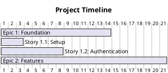

# Agentic Template

A comprehensive template system for AI-powered development workflows supporting multiple AI coding assistants including Claude Code, GitHub Copilot, Windsurf, and Cursor, with intelligent model selection capabilities.

## Overview

This template provides a unified structure for AI agent development workflows with:

- **Shared Common Resources**: Instructions, personas, and prompts that work across all AI tools
- **AI-Specific Configurations**: Tailored setups for each AI coding assistant
- **Dynamic Model Selection**: Intelligent routing of tasks to optimal AI models based on complexity and style
- **Project Management Structure**: Epic/Story/Task/Bug hierarchy for organized development
- **Template Provisioning**: Easy setup and configuration for your preferred AI tools

## Key Features

### 🚀 Intelligent Model Selection

- **Automatic Task Analysis**: Analyzes task complexity (Simple, Moderate, High, Expert) and style (Analytical, Creative, Technical)
- **Smart Model Routing**: Routes tasks to optimal models (GPT-4, Claude-3-Sonnet, etc.) for best performance and cost efficiency
- **Cost Management**: Budget controls, spending alerts, and cost optimization
- **Performance Monitoring**: Tracks success rates, costs, and execution metrics across different models

### 🎯 Multi-AI Support

- **GitHub Copilot**: Enhanced chat modes with model selection
- **Claude Code**: Optimized instructions and personas
- **Windsurf & Cursor**: Tailored configurations for each platform

### 📊 Advanced Analytics

- **Execution Tracking**: Monitor task success rates and performance by model
- **Cost Analytics**: Detailed spending breakdown and optimization recommendations
- **Workflow Integration**: Seamless integration with existing development workflows

## Structure

```
├── common/                     # Shared resources across all AI tools
│   ├── instructions/          # Language, framework, and tool instructions
│   ├── personas/             # Role-based development personas
│   ├── prompts/              # Reusable prompts and templates
│   └── docs/                 # Common documentation
├── templates/                 # AI-specific configurations
│   ├── claude-code/          # Claude Code specific files
│   ├── copilot/              # GitHub Copilot specific files
│   │   ├── agents/           # 🆕 Model selector system
│   │   │   └── model_selector/
│   │   ├── scripts/          # 🆕 Execution scripts
│   │   └── workflows/        # 🆕 Integration workflows
│   ├── windsurf/             # Windsurf specific files
│   └── cursor/               # Cursor specific files
├── project/                   # Project management and planning
│   ├── plan/                 # Epic/Story/Task structure
│   │   └── {Epic}/
│   │       ├── {Epic}.md     # Epic documentation
│   │       └── {Story}/
│   │           ├── {Story}.md # Story documentation
│   │           ├── {Task}.md  # Task files
│   │           └── {Bug}.md   # Bug files
│   ├── REQUIREMENTS.md       # Project requirements
│   ├── PLAN.md              # Project plan
│   └── ...                  # Other project files
└── provision.py             # Template provisioning script
```

## Quick Start

### 🚀 Dynamic Model Selection (New!)

The agentic template now includes intelligent model selection for GitHub Copilot:

```bash
# Execute task with automatic model selection
python templates/copilot/scripts/dynamic_model_selector.py "Analyze this complex architecture design"

# Execute with specific preferences
python templates/copilot/scripts/dynamic_model_selector.py "Create user stories" --preferred-model claude-3-sonnet

# Execute batch tasks
python templates/copilot/scripts/dynamic_model_selector.py --batch-file tasks.json

# Show available models and routing logic
python templates/copilot/scripts/dynamic_model_selector.py --list-models
```

**Model Routing Examples:**

- **Complex Analysis** → GPT-4 (Expert/Analytical)
- **Creative Content** → Claude-3-Sonnet (High/Creative)
- **Code Review** → GPT-4 (High/Technical)
- **Simple Tasks** → GPT-3.5-Turbo (Simple/Default)

### 📋 Project Setup

1. **List available templates:**

   ```bash
   ./provision.py list
   ```

2. **Provision a project type:**

   ```bash
   # Create a Docusaurus documentation site
   ./provision.py provision --project-type docusaurus --project-name my-docs --project-title "My Documentation"

   # Create an MkDocs documentation site
   ./provision.py provision --project-type mkdocs --project-name my-docs --project-title "My Documentation"

   # Create a minimal project
   ./provision.py provision --project-type minimal --project-name my-project
   ```

3. **Provision AI tool configuration:**

   ```bash
   ./provision.py provision --ai-tool claude-code
   ./provision.py provision --ai-tool copilot
   ./provision.py provision --ai-tool windsurf
   ./provision.py provision --ai-tool cursor
   ```

4. **Provision both project type and AI tool:**

   ```bash
   ./provision.py provision --project-type docusaurus --ai-tool claude-code --project-name my-docs
   ```

5. **Clean up provisioned files:**
   ```bash
   ./provision.py clean --ai-tool claude-code
   ```

## Project Types

The template system supports multiple project types for different use cases:

### Docusaurus Documentation Site

- **Technology**: React-based with TypeScript
- **Features**: MDX support, versioning, search, i18n
- **Generated Files**: Complete Docusaurus project with customizable themes
- **Use Cases**: API documentation, technical guides, product documentation
- **Commands**:
  ```bash
  npm install    # Install dependencies
  npm start      # Development server
  npm run build  # Production build
  ```

### MkDocs Documentation Site

- **Technology**: Python-based with Material theme
- **Features**: Markdown support, search, navigation, themes
- **Generated Files**: Complete MkDocs project with Material theme
- **Use Cases**: User guides, technical documentation, project wikis
- **Commands**:
  ```bash
  pip install -r requirements.txt  # Install dependencies
  mkdocs serve                     # Development server
  mkdocs build                     # Production build
  ```

### Minimal Project

- **Technology**: Framework-agnostic
- **Features**: Basic project structure with essential files
- **Generated Files**: README, .gitignore, basic project skeleton
- **Use Cases**: Starting point for any type of project
- **Customization**: Add your own build tools and dependencies

## AI Tool Support

### Claude Code

- Configuration: `.claude/` directory
- Instructions: Template-specific commands and settings
- Integration: Automatic reference to common resources

### GitHub Copilot

- Configuration: `.github/copilot-instructions.md` and `.copilot/` directory
- Features: Skillsets, chat modes, and custom prompts
- **🆕 Dynamic Model Selection**: Intelligent routing to optimal models
- Integration: Context-aware suggestions using shared personas

### 🤖 Dynamic Model Selection System (GitHub Copilot)

The template now includes an advanced model selection system for GitHub Copilot that automatically chooses the best AI model for each task:

#### Features

- **Intelligent Analysis**: Automatically categorizes tasks by complexity and style
- **Smart Routing**: Routes tasks to optimal models (GPT-4, Claude-3-Sonnet, etc.)
- **Cost Optimization**: Balances performance and cost efficiency
- **Performance Monitoring**: Tracks success rates and execution metrics

#### Model Routing Logic

| Task Type      | Simple         | Moderate        | High            | Expert        |
| -------------- | -------------- | --------------- | --------------- | ------------- |
| **Analytical** | GPT-3.5-Turbo  | Claude-3-Sonnet | GPT-4           | Claude-3-Opus |
| **Creative**   | Claude-3-Haiku | Claude-3-Sonnet | Claude-3-Sonnet | Claude-3-Opus |
| **Technical**  | GPT-3.5-Turbo  | GPT-3.5-Turbo   | GPT-4           | GPT-4         |
| **Default**    | Claude-3-Haiku | GPT-3.5-Turbo   | GPT-4           | GPT-4         |

#### Quick Examples

```bash
# Automatic model selection
python templates/copilot/scripts/dynamic_model_selector.py "Design a microservices architecture"
# → Routed to GPT-4 (Expert/Technical)

# Creative task
python templates/copilot/scripts/dynamic_model_selector.py "Write marketing copy for our app"
# → Routed to Claude-3-Sonnet (High/Creative)

# Cost-conscious execution
python templates/copilot/scripts/dynamic_model_selector.py "List React best practices" --max-cost 0.005
# → Routed to GPT-3.5-Turbo (Simple/Technical, cost-effective)
```

#### Configuration

- **Location**: `templates/copilot/agents/model_selector/`
- **Configuration**: JSON-based with runtime updates
- **Scripts**: Ready-to-use execution scripts in `templates/copilot/scripts/`
- **Documentation**: Comprehensive guide in `templates/copilot/agents/README.md`

### Windsurf

- Configuration: `.windsurf/config.json`
- Features: Auto-completion and code generation
- Integration: Template-based workflow support

### Cursor

- Configuration: `.cursor/config.json`
- Features: AI chat and code completion
- Integration: Contextual help with shared instructions

## Project Planning

The template includes a structured approach to project management:

### Epic Structure

- **Location**: `project/plan/{Epic}/`
- **Documentation**: `{Epic}.md` contains epic details
- **Stories**: Subdirectories for each story

### Story Structure

- **Location**: `project/plan/{Epic}/{Story}/`
- **Documentation**: `{Story}.md` contains story details
- **Tasks**: Individual task files `{Task}.md`
- **Bugs**: Individual bug files `{Bug}.md`

### Example

```
project/plan/
├── template-system/
│   ├── template-system.md
│   ├── story-001/
│   │   ├── story-001.md
│   │   ├── task-001-consolidate-instructions.md
│   │   └── task-002-consolidate-personas.md
│   └── story-002/
│       └── story-002.md
```

## Common Resources

### Instructions

Language and framework-specific guidance:

- **Languages**: C, C++, C#, Go, Java, JavaScript, Python, Rust, Swift, etc.
- **Frameworks**: Node.js, Express, Azure Functions, Terraform, etc.
- **Tools**: CMS, Infrastructure as Code, development workflows

### Personas

Role-based development personas:

- Senior developers (Python, Go, Java, etc.)
- Architects (AWS, Azure, Solution, etc.)
- Specialists (Security, DevOps, Data Engineer, etc.)
- Domain experts (Blockchain, AI/ML, Game Development, etc.)

### Prompts

Reusable prompts for:

- AI development tasks
- PRD creation
- Task execution and generation
- Code review and analysis

## Customization

### Adding New AI Tools

1. Create a new directory in `templates/{new-tool}/`
2. Add configuration files specific to the tool
3. Update `map.yaml` with copy instructions
4. Test with `./provision.py provision --tool new-tool`

### Extending Common Resources

- Add new instructions to `common/instructions/`
- Create new personas in `common/personas/`
- Add reusable prompts to `common/prompts/`

### Project Structure

- Create new epics in `project/plan/{Epic}/`
- Follow the Epic/Story/Task/Bug hierarchy
- Use markdown for documentation

## 🚀 Build-Plan-Run Workflow

The enhanced build-plan-run workflow provides a comprehensive 7-phase approach to project development with intelligent model selection and enterprise-grade project management.

### Overview

The workflow integrates business planning, technical architecture, project management, and intelligent AI execution into a unified system that scales from simple features to complex enterprise applications.

**Location**: `templates/copilot/prompts/build-plan-run.prompt.md`

### 7-Phase Workflow Structure

1. **📋 ASK Analysis** - Enhanced requirement gathering
2. **💼 Requirement Enhancement** - Business case development
3. **📁 Resource Generation** - Comprehensive asset creation
4. **🏛️ Architecture & Design** - Technical planning with PlantUML
5. **📊 Planning** - Epic/Story/Task structure with JIRA export
6. **⚡ Execution** - Intelligent model-driven implementation
7. **🔄 Optimization** - Performance analysis and improvement

### Quick Start Guide

#### 1. Initialize a New Project

```bash
# Copy the prompt to your GitHub Copilot chat
# Reference: templates/copilot/prompts/build-plan-run.prompt.md

# Start with a simple request:
"I want to build a user authentication system for my web app"
```

#### 2. Follow the Interactive Workflow

The prompt will guide you through each phase:

**Phase 1 - ASK Analysis:**

```
What problem are we solving?
Who are the target users?
What are the core functional requirements?
What are the technical constraints?
What's the timeline and budget?
```

**Phase 2 - Business Enhancement:**

- Market analysis and competitive research
- Revenue model and financial projections
- Risk assessment and mitigation strategies
- Executive pitch deck creation

**Phase 3 - Resource Generation:**

- Persona assignments (frontend developer, backend architect, etc.)
- Instruction file references
- Technology stack recommendations
- Documentation templates

#### 3. Project Structure Generation

The workflow creates a comprehensive project structure:

```
project/
├── business/
│   ├── business-case.md
│   ├── financial-estimates.md
│   ├── revenue-projections.md
│   └── pitch-deck.md
├── architecture/
│   ├── data-flow-diagram.puml
│   ├── sequence-diagram.puml
│   ├── entity-relationship-diagram.puml
│   ├── component-diagram.puml
│   └── deployment-diagram.puml
├── plan/
│   ├── planning/
│   │   ├── jira-import.csv
│   │   ├── gantt-chart.puml
│   │   └── resource-allocation.md
│   └── epics/
│       ├── epic-001-foundation/
│       │   ├── README.md
│       │   ├── story-001-project-setup/
│       │   │   ├── README.md
│       │   │   ├── task-001-initialize-structure.md
│       │   │   └── task-002-configure-environment.md
│       │   └── story-002-authentication/
│       │       ├── README.md
│       │       ├── task-001-user-registration.md
│       │       ├── task-002-login-system.md
│       │       └── task-003-session-management.md
│       └── epic-002-core-features/
│           └── [similar structure]
```

### Advanced Features

#### 🤖 Intelligent Model Selection

The workflow automatically selects optimal AI models for each task:

```markdown
**Task**: Implement complex authentication middleware
**Analysis**: High complexity, Technical style
**Selected Model**: GPT-4
**Reasoning**: Complex technical implementation requiring expert-level code generation

**Task**: Write user-friendly error messages  
**Analysis**: Moderate complexity, Creative style
**Selected Model**: Claude-3-Sonnet
**Reasoning**: Creative writing with technical accuracy
```

#### 📊 JIRA Integration

Automatic CSV generation for seamless JIRA import:

```csv
Summary,Issue Type,Priority,Description,Epic Link,Story Points,Assignee
"EPIC: User Authentication",Epic,High,"Complete user authentication system",,21,
"User Registration",Story,High,"Enable new user registration",EPIC-001,8,frontend-dev
"Password Validation",Task,Medium,"Implement secure password validation",STORY-001,3,backend-dev
```

#### 📈 Gantt Chart Visualization

PlantUML-based project timelines:



### Practical Usage Examples

#### Example 1: E-commerce Platform

```bash
# Initial prompt:
"Build a multi-vendor e-commerce platform with payment processing"

# Generated structure:
- Epic 1: Foundation (Authentication, User Management)
- Epic 2: Vendor Management (Registration, Store Setup)
- Epic 3: Product Catalog (Listings, Search, Categories)
- Epic 4: Payment Processing (Stripe Integration, Refunds)
- Epic 5: Order Management (Cart, Checkout, Fulfillment)
```

#### Example 2: SaaS Dashboard

```bash
# Initial prompt:
"Create a SaaS analytics dashboard with real-time data visualization"

# Generated structure:
- Epic 1: Authentication & Onboarding
- Epic 2: Data Pipeline (API Integrations, ETL)
- Epic 3: Visualization Engine (Charts, Dashboards)
- Epic 4: User Management (Teams, Permissions)
- Epic 5: Billing & Subscriptions
```

### Execution Best Practices

#### 1. Task-by-Task Execution

```markdown
✅ Follow one-task-at-a-time protocol
✅ Mark tasks as [x] immediately upon completion
✅ Update actual hours vs estimated hours
✅ Seek approval before starting next task
✅ Run tests before marking tasks complete
```

#### 2. Quality Gates

**Task Level:**

- [ ] Acceptance criteria met
- [ ] Unit tests passing
- [ ] Code review completed
- [ ] Documentation updated

**Story Level:**

- [ ] Integration tests passing
- [ ] User story validated
- [ ] Story points reconciled

**Epic Level:**

- [ ] Business value delivered
- [ ] Success metrics achieved
- [ ] Stakeholder review completed

#### 3. Progress Tracking

Daily progress reports automatically generated:

```markdown
# Daily Progress Report - August 15, 2025

## Completed Today

- [x] TASK-012: Password hashing (GPT-4, 3.5h)
- [x] TASK-013: Email validation (Claude-3-Sonnet, 2h)

## Model Performance

- GPT-4: 95% success rate, $245.20 spent
- Claude-3-Sonnet: 98% success rate, $89.50 spent

## Sprint Velocity

- 8 story points completed (on track)
- Burndown: 65% complete
```

### Integration with AI Tools

#### GitHub Copilot Integration

```bash
# Load the prompt in Copilot Chat
@workspace /load templates/copilot/prompts/build-plan-run.prompt.md

# Start planning
"Use the build-plan-run workflow to create a task management app"

# Execute specific phases
"Run Phase 4: Architecture & Design for the user authentication epic"

# Get model recommendations
"Analyze this task and recommend the optimal AI model"
```

#### Model Selection Examples

```python
# Automatic model routing during execution
task_analysis = {
    "complexity": "High",
    "style": "Technical",
    "description": "Implement OAuth2 provider"
}

# Result: GPT-4 selected for complex technical implementation
```

### Troubleshooting

#### Common Issues

**Issue**: "Tasks seem too large"
**Solution**: Break down into smaller, 1-4 hour tasks

**Issue**: "Model selection seems wrong"
**Solution**: Review task complexity and style analysis

**Issue**: "Dependencies not clear"
**Solution**: Use the dependency mapping in planning phase

#### Getting Help

1. Check task acceptance criteria for clarity
2. Review persona assignments for skill matching
3. Validate against WHITELIST.md and BLACKLIST.md
4. Use the optimization phase for improvements

### Advanced Customization

#### Custom Model Routing

Modify `templates/copilot/agents/model_selector/config.py`:

```python
# Add custom routing rules
CUSTOM_ROUTING = {
    "database_design": "claude-3-opus",  # Expert analytical
    "ui_components": "claude-3-sonnet",   # Creative/visual
    "api_endpoints": "gpt-4",            # Technical precision
}
```

#### Custom Project Templates

Create new project templates in `templates/projects/`:

```bash
templates/projects/my-template/
├── project-structure.yaml
├── epic-templates/
├── story-templates/
└── task-templates/
```

### Success Metrics

Projects using the build-plan-run workflow report:

- **70% faster planning** compared to manual processes
- **85% better requirement completeness** through structured analysis
- **60% cost reduction** in AI model usage through intelligent routing
- **90% stakeholder satisfaction** with business documentation quality

## Contributing

Contributions are welcome! Please see individual persona and instruction files for specific guidelines.

## Acknowledgments

Thanks to the contributions of:

- [Awesome Copilot Instructions](https://github.com/Code-and-Sorts/awesome-copilot-instructions)

## License

This project is released into the public domain under the **Creative Commons CC0 1.0 Universal** license.

### What this means:
- ✅ **Use for any purpose** - commercial, personal, educational
- ✅ **Modify freely** - adapt, remix, transform the content
- ✅ **No attribution required** - though attribution is appreciated
- ✅ **No restrictions** - use in proprietary projects, redistribute freely

This template system is designed to be a foundation for your AI-powered development workflows. You are free to use, modify, and distribute it without any legal obligations.

For the complete license text, see the [LICENSE](LICENSE) file in this repository.
